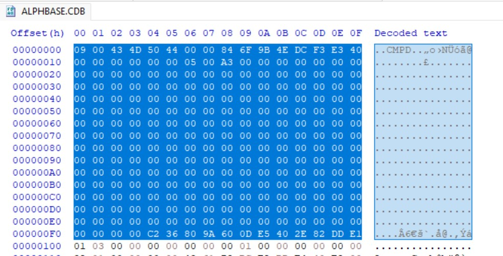

# Viewing Binary Files

## HxD Hex Editor

HxD is a free hexadecimal editor for Microsoft Windows developed by Maël Hörz. It allows users to view and modify the raw binary contents of files, disks, and process memory, making it a valuable tool for inspecting and reverse-engineering binary file formats.

The editor displays data in hexadecimal form alongside an ASCII interpretation, allowing individual bytes and data structures to be examined directly. HxD supports files of virtually any size and provides features such as hexadecimal and text search, checksum calculation, file comparison, data export, and binary pattern insertion.

Throughout this documentation, HxD is used to illustrate the binary layout of Compound Database (CDB) files. Offsets, byte sequences, and example screenshots were obtained using HxD version 2.5.0. Readers wishing to explore the database structure themselves may download HxD from the official website:

<https://mh-nexus.de/en/hxd/>

## HxD snippets

<figure markdown>
  { width="75%" .left}
  <figcaption>A screenshot of a CDB file opened in HxD viewer. </figcaption>
</figure>

1. **Offset column** - file position in hexadecimal.
2. **Hexadecimal view** - raw bytes stored in the file.
3. **ASCII view** - printable character interpretation.
4. **Selected bytes** - the CDB file header.

