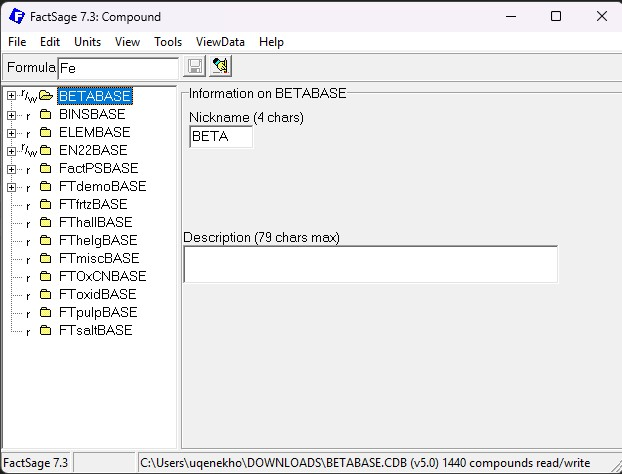
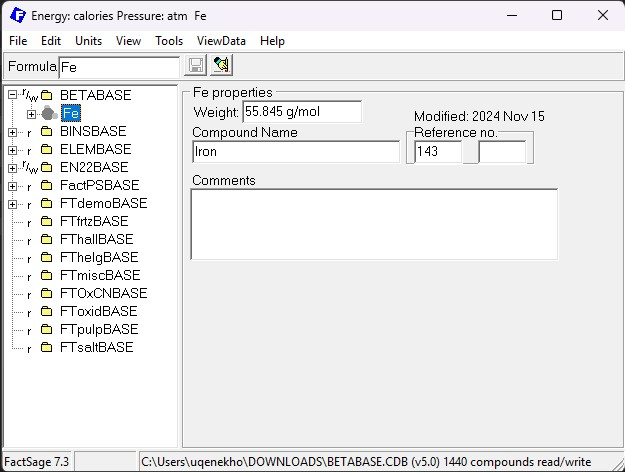
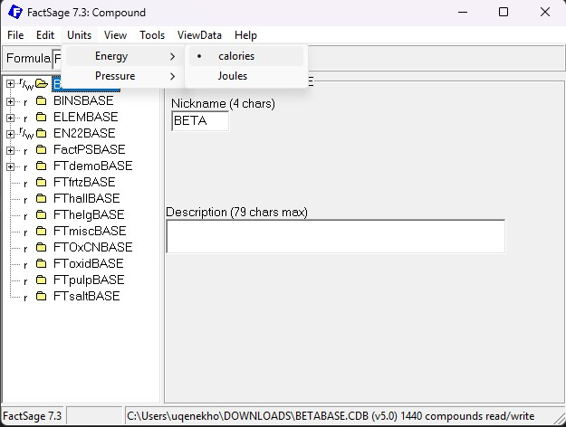
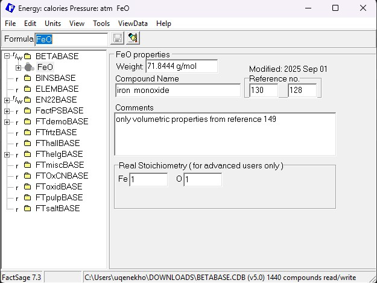
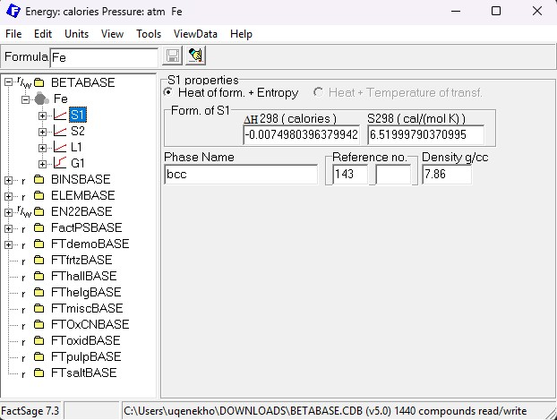
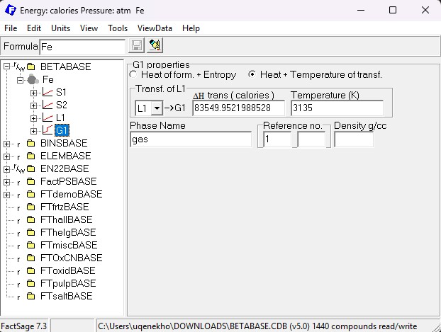
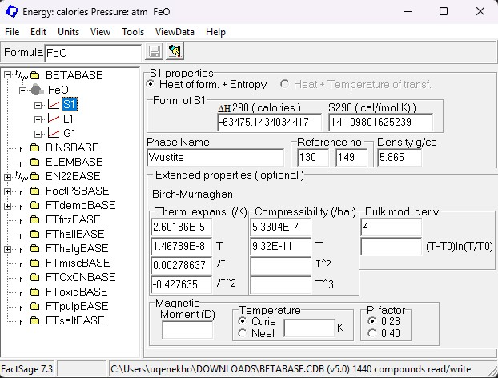
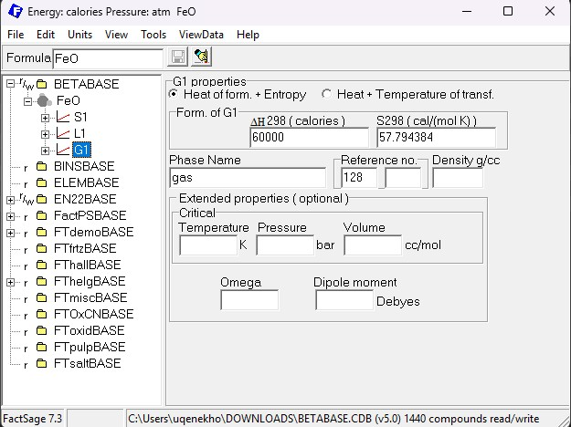

# Block types

## HEADER Block (ID 09)

| **NAME** | **TYPE** | **SIZE, BYTES** | **DESCRIPTION** | **Area on the screenshot** |
|---|---|---|---|---|
| CHUNK_ID             | U8          | 1      | Block identifier (09)                                                       |              <N/A>                 |
| PADDING1             | B1          | 1      | Filler type                                                                 |              <N/A>                 |
| MAGIC                | B4          | 4      | Unique combination for Compound Databases (=CMPD).                          |              <N/A>                 |
| PADDING2             | B2          | 2      | Filler type                                                                 |              <N/A>                 |
| TIMESTAMP            | OLEDATE     | 8      | Last change data, Windows OLE format.                                       |              <N/A>                 |
| READ_ONLY            | B1          | 1      | Nonzero if the database is write-protected (usually official databases).    | Greyed out entries if read-only.   |
| UNKNOWN1             | B11         | 11     | ???                                                                         |              <N/A>                 |
| COMMENT              | S11         | 90     | Database description                                                        | Description box in the screenshot. |
| PADDING3             | B136        | 136    | Filler type                                                                 |              <N/A>                 |
| UNKNOWN2             | B12         | 12     | ???                                                                         |              <N/A>                 |

<figure markdown>
  {width="75%"}
  <figcaption>A screenshot of the main Compound module interface. </figcaption>
</figure>

## COMPOUND Block (ID 01)

| **NAME** | **TYPE** | **SIZE, BYTES** | **DESCRIPTION** | **Area on the screenshot** |
|---|---|---|---|---|
| CHUNK_ID             | U1          |   1    | Block identifier (01)                                                       |                                    |
| **ELEMENT_IDS**      | **U1x7**    | **7**  | **1-Byte integers corresponding to element ids in PD, MAX 7 elements.**     | Parsed from `Formula` entry box.   |
| **ELEMENT_COEFFS**   | **U1x7**    | **7**  | **1-Byte integers corresponding to element coefficients, MAX 7 elements.**  | Parsed from `Formula` entry box.   |
| **CHARGE_RAW**       | **I1**      | **1**  | **Formula charge.**                                                         | Parsed from `Formula` entry box.   |
| **ENTRY NUMBER**     | **U1**      | **1**  | **Internal FactSage help.**                                                 | `Reference no.` boxes (which one?).|
| **REFERENCE**        | **U2**      | **2**  | **Internal FactSage help.**                                                 | `Reference no.` boxes (which one?).|
| **TIMESTAMP**        | **OLEDATE** | **8**  | **Last change data, Windows OLE format.**                                   | `Modified :` above `Reference no.` |
| **UNKNOWN1**         | **B2**      | **2**  | **Filler type.**                                                            |               <N/A>                |
| COMPOUND NAME        | S40         | 40     | Name of the compound.                                                       |  `Compound name` box.              |
| RESERVED STRING1     | S40         | 40     | ???                                                                         |                ???                 |
| FORMULA NAME         | S40         | 40     | Formula string.                                                             |  Input string from `Formula`.      |
| UNKNOWN              | B4          | 4      | ???                                                                         |               <N/A>                |
| UNIT ENERGY          | ???         | 4      | J, cal                                                                      |     `Energy` menu.                 |
| UNIT PRESSURE        | ???         | 4      | atm, bar                                                                    |     `Pressure` menu.               |
| RESERVED STRING2     | S12         | 12     | ???                                                                         |                ???                 |
| COEFF REAL           | F8x7        | 28     | Real coefficients for fractional formulas, i.g. Fe0.986O                    |     `Real stochiometry`            |
| PADDING              | B24         | 24     | Filler type.                                                                |               <N/A>                |

<figure>
  
  <figcaption>A compound entry to a database. </figcaption>
</figure>

<figure>
  
  <figcaption>Compound units. </figcaption>
</figure>

<figure>
  
  <figcaption>Real stoichiometry. </figcaption>
</figure>

## PHASES Block

<figure>
  
  <figcaption>Phase I type. </figcaption>
</figure>

<figure>
  
  <figcaption>Phase II type. </figcaption>
</figure>

<figure>
  
  <figcaption>Extended properties. </figcaption>
</figure>

<figure>
  
  <figcaption>Gas extended properties. </figcaption>
</figure>

### PHASE1 Block (ID 07)

| **NAME** | **TYPE** | **SIZE, BYTES** | **DESCRIPTION** |
|---|---|---|---|
| CHUNK_ID         | U1      | 1  | Block identifier (07) |
| **ELEMENT_IDS**      | **U1x7**    | **7**  | **1-Byte integers corresponding to element ids in PD, MAX 7 elements.**     |
| **ELEMENT_COEFFS**   | **U1x7**    | **7**  | **1-Byte integers corresponding to element coefficients, MAX 7 elements.**  |
| **CHARGE_RAW**       | **I1**      | **1**  | **Formula charge.**                                                         |
| **ENTRY NUMBER**     | **U1**      | **1**  | **Internal FactSage help.**                                                 |
| **REFERENCE**        | **U2**      | **2**  | **Internal FactSage help.**                                                 |
| **TIMESTAMP**        | **OLEDATE** | **8**  | **Last change data, Windows OLE format.**                                   |
| **UNKNOWN1**         | **B2**      | **2**  | **Filler type.**                                                            |
| ENTHALPY             |   F8        |   8    |                                                                             |
| ENTROPY              |   F8        |   8    |                                                                             |
| PHASEID RAW NEG      |   U4        |   4    |                                                                             |
| PHASEID RAW          |   U4        |   4    |                                                                             |
| DENSITY RAW          |   F8        |   8    |                                                                             |
| T EXPANSION COEFFS   |   F4x4      |   16   |                                                                             |
| COMPRESSIBILITY COEFFS|  F4x4      |   16   |                                                                             |
| BULK MODULUS DERIV   |   F4x2      |   16   |                                                                             |
| TEMPERATURE MAGN     |   F4        |   4    |                                                                             |
| MOMENT MAGN          |   F4        |   4    |                                                                             |
| PFACTOR              |   F4        |   4    |                                                                             |
| PADDING              |   B20       |  20    |                                                                             |
| PHASE NAME           |   S40       |  40    |                                                                             |
| PADDING              |   B80       |  80    |                                                                             |

### PHASE2 Block (ID 08)

| **NAME** | **TYPE** | **SIZE, BYTES** | **DESCRIPTION** |
|---|---|---|---|
| CHUNK_ID         | U1      | 1  | Block identifier (08) |
| **ELEMENT_IDS**      | **U1x7**    | **7**  | **1-Byte integers corresponding to element ids in PD, MAX 7 elements.**     |
| **ELEMENT_COEFFS**   | **U1x7**    | **7**  | **1-Byte integers corresponding to element coefficients, MAX 7 elements.**  |
| **CHARGE_RAW**       | **I1**      | **1**  | **Formula charge.**                                                         |
| **ENTRY NUMBER**     | **U1**      | **1**  | **Internal FactSage help.**                                                 |
| **REFERENCE**        | **U2**      | **2**  | **Internal FactSage help.**                                                 |
| **TIMESTAMP**        | **OLEDATE** | **8**  | **Last change data, Windows OLE format.**                                   |
| **UNKNOWN1**         | **B2**      | **2**  | **Filler type.**                                                            |
| TRANSITION ENTHALPY  |   F8        |   8    |                                                                             |
| TRANSITION TEMPERATURE|  F8        |   8    |                                                                             |
| PHASEID RAW PARENT   |   U4        |   4    |                                                                             |
| PHASEID RAW          |   U4        |   4    |                                                                             |
| DENSITY RAW          |   F8        |   8    |                                                                             |
| T EXPANSION COEFFS   |   F4x4      |   16   |                                                                             |
| COMPRESSIBILITY COEFFS|  F4x4      |   16   |                                                                             |
| BULK MODULUS DERIV   |   F4x2      |   16   |                                                                             |
| TEMPERATURE MAGN     |   F4        |   4    |                                                                             |
| MOMENT MAGN          |   F4        |   4    |                                                                             |
| PFACTOR              |   F4        |   4    |                                                                             |
| PADDING              |   B20       |  20    |                                                                             |
| PHASE NAME           |   S40       |  40    |                                                                             |
| PADDING              |   B80       |  80    |                                                                             |

## CP Blocks

### CP1 Block (ID 02)

| **NAME** | **TYPE** | **SIZE, BYTES** | **DESCRIPTION** |
|---|---|---|---|
| CHUNK_ID             | U1          |   1    | Block identifier (02)                                                       |
| **ELEMENT_IDS**      | **U1x7**    | **7**  | **1-Byte integers corresponding to element ids in PD, MAX 7 elements.**     |
| **ELEMENT_COEFFS**   | **U1x7**    | **7**  | **1-Byte integers corresponding to element coefficients, MAX 7 elements.**  |
| **CHARGE_RAW**       | **I1**      | **1**  | **Formula charge.**                                                         |
| **ENTRY NUMBER**     | **U1**      | **1**  | **Internal FactSage help.**                                                 |
| **REFERENCE**        | **U2**      | **2**  | **Internal FactSage help.**                                                 |
| **TIMESTAMP**        | **OLEDATE** | **8**  | **Last change data, Windows OLE format.**                                   |
| **UNKNOWN1**         | **B2**      | **2**  | **Filler type.**                                                            |
| ENTHALPY             | F8          |   8    | Enthalpy at the lower end of the interval?                                  |
| ENTROPY              | F8          |   8    | Entropy  at the lower end of the interval?                                  |
| PHASEID RAW          | U4          |   4    | ???                                                                         |
| UNKNOWN1             | B4          |   4    | ???                                                                         |
| TMIN                 | F8          |   8    | Minimum interval temperature, K.                                            |
| TMAX                 | F8          |   8    | Maximum interval temperature, K.                                            |
| CP COEFFS            | F8x8        |   64   | Heat capacity coefficients.                                                 |
| CP POWERS            | F8x8        |   64   | Heat capacity powers.                                                       |
| PADDING              | B56         |   56   | Filler type.                                                                |

### CP2 Block (ID 04)

| **NAME** | **TYPE** | **SIZE, BYTES** | **DESCRIPTION** |
|---|---|---|---|
| CHUNK_ID             | U1          |   1    | Block identifier (04)                                                       |
| **ELEMENT_IDS**      | **U1x7**    | **7**  | **1-Byte integers corresponding to element ids in PD, MAX 7 elements.**     |
| **ELEMENT_COEFFS**   | **U1x7**    | **7**  | **1-Byte integers corresponding to element coefficients, MAX 7 elements.**  |
| **CHARGE_RAW**       | **I1**      | **1**  | **Formula charge.**                                                         |
| **ENTRY NUMBER**     | **U1**      | **1**  | **Internal FactSage help.**                                                 |
| **REFERENCE**        | **U2**      | **2**  | **Internal FactSage help.**                                                 |
| **TIMESTAMP**        | **OLEDATE** | **8**  | **Last change data, Windows OLE format.**                                   |
| **UNKNOWN1**         | **B2**      | **2**  | **Filler type.**                                                            |
| ENTHALPY             | F8          |   8    | Enthalpy at the lower end of the interval?                                  |
| ENTROPY              | F8          |   8    | Entropy  at the lower end of the interval?                                  |
| PHASEID RAW          | U4          |   4    | ???                                                                         |
| UNKNOWN1             | B4          |   4    | ???                                                                         |
| TMIN                 | F8          |   8    | Minimum interval temperature, K.                                            |
| TMAX                 | F8          |   8    | Maximum interval temperature, K.                                            |
| CP COEFFS            | F8x8        |   64   | Heat capacity coefficients.                                                 |
| CP POWERS            | F8x8        |   64   | Heat capacity powers.                                                       |
| PADDING              | B56         |   56   | Filler type.                                                                |

### CP3 Block (ID 05)

| **NAME** | **TYPE** | **SIZE, BYTES** | **DESCRIPTION** |
|---|---|---|---|
| CHUNK_ID             | U1          |   1    | Block identifier (05)                                                       |
| **ELEMENT_IDS**      | **U1x7**    | **7**  | **1-Byte integers corresponding to element ids in PD, MAX 7 elements.**     |
| **ELEMENT_COEFFS**   | **U1x7**    | **7**  | **1-Byte integers corresponding to element coefficients, MAX 7 elements.**  |
| **CHARGE_RAW**       | **I1**      | **1**  | **Formula charge.**                                                         |
| **ENTRY NUMBER**     | **U1**      | **1**  | **Internal FactSage help.**                                                 |
| **REFERENCE**        | **U2**      | **2**  | **Internal FactSage help.**                                                 |
| **TIMESTAMP**        | **OLEDATE** | **8**  | **Last change data, Windows OLE format.**                                   |
| **UNKNOWN1**         | **B2**      | **2**  | **Filler type.**                                                            |
| ENTHALPY             | F8          |   8    | Enthalpy at the lower end of the interval?                                  |
| ENTROPY              | F8          |   8    | Entropy  at the lower end of the interval?                                  |
| PHASEID RAW          | U4          |   4    | ???                                                                         |
| UNKNOWN1             | B4          |   4    | ???                                                                         |
| TMIN                 | F8          |   8    | Minimum interval temperature, K.                                            |
| TMAX                 | F8          |   8    | Maximum interval temperature, K.                                            |
| CP COEFFS            | F8x8        |   64   | Heat capacity coefficients.                                                 |
| CP POWERS            | F8x8        |   64   | Heat capacity powers.                                                       |
| PADDING              | B56         |   56   | Filler type.                                                                |

### CP4 Block (ID 03)

| **NAME** | **TYPE** | **SIZE, BYTES** | **DESCRIPTION** |
|---|---|---|---|
| CHUNK_ID             | U1          |   1    | Block identifier (03)                                                       |
| **ELEMENT_IDS**      | **U1x7**    | **7**  | **1-Byte integers corresponding to element ids in PD, MAX 7 elements.**     |
| **ELEMENT_COEFFS**   | **U1x7**    | **7**  | **1-Byte integers corresponding to element coefficients, MAX 7 elements.**  |
| **CHARGE_RAW**       | **I1**      | **1**  | **Formula charge.**                                                         |
| **ENTRY NUMBER**     | **U1**      | **1**  | **Internal FactSage help.**                                                 |
| **REFERENCE**        | **U2**      | **2**  | **Internal FactSage help.**                                                 |
| **TIMESTAMP**        | **OLEDATE** | **8**  | **Last change data, Windows OLE format.**                                   |
| **UNKNOWN1**         | **B2**      | **2**  | **Filler type.**                                                            |
| ENTHALPY             | F8          |   8    | Enthalpy at the lower end of the interval?                                  |
| ENTROPY              | F8          |   8    | Entropy  at the lower end of the interval?                                  |
| PHASEID RAW          | U4          |   4    | ???                                                                         |
| UNKNOWN1             | B4          |   4    | ???                                                                         |
| TMIN                 | F8          |   8    | Minimum interval temperature, K.                                            |
| TMAX                 | F8          |   8    | Maximum interval temperature, K.                                            |
| CP COEFFS            | F8x8        |   64   | Heat capacity coefficients.                                                 |
| CP POWERS            | F8x8        |   64   | Heat capacity powers.                                                       |
| PADDING              | B56         |   56   | Filler type.                                                                |

### CP5 Block (ID 06)

| **NAME** | **TYPE** | **SIZE, BYTES** | **DESCRIPTION** |
|---|---|---|---|
| CHUNK_ID             | U1          |   1    | Block identifier (06)                                                       |
| **ELEMENT_IDS**      | **U1x7**    | **7**  | **1-Byte integers corresponding to element ids in PD, MAX 7 elements.**     |
| **ELEMENT_COEFFS**   | **U1x7**    | **7**  | **1-Byte integers corresponding to element coefficients, MAX 7 elements.**  |
| **CHARGE_RAW**       | **I1**      | **1**  | **Formula charge.**                                                         |
| **ENTRY NUMBER**     | **U1**      | **1**  | **Internal FactSage help.**                                                 |
| **REFERENCE**        | **U2**      | **2**  | **Internal FactSage help.**                                                 |
| **TIMESTAMP**        | **OLEDATE** | **8**  | **Last change data, Windows OLE format.**                                   |
| **UNKNOWN1**         | **B2**      | **2**  | **Filler type.**                                                            |
| ENTHALPY             | F8          |   8    | Enthalpy at the lower end of the interval?                                  |
| ENTROPY              | F8          |   8    | Entropy  at the lower end of the interval?                                  |
| PHASEID RAW          | U4          |   4    | ???                                                                         |
| UNKNOWN1             | B4          |   4    | ???                                                                         |
| TMIN                 | F8          |   8    | Minimum interval temperature, K.                                            |
| TMAX                 | F8          |   8    | Maximum interval temperature, K.                                            |
| CP COEFFS            | F8x8        |   64   | Heat capacity coefficients.                                                 |
| CP POWERS            | F8x8        |   64   | Heat capacity powers.                                                       |
| PADDING              | B56         |   56   | Filler type.                                                                |

## COMMENT Block (ID 10)

| **NAME** | **TYPE** | **SIZE, BYTES** | **DESCRIPTION** |
|---|---|---|---|
| CHUNK_ID             | U1          |   1    | Block identifier (10)                                                       |
| **ELEMENT_IDS**      | **U1x7**    | **7**  | **1-Byte integers corresponding to element ids in PD, MAX 7 elements.**     |
| **ELEMENT_COEFFS**   | **U1x7**    | **7**  | **1-Byte integers corresponding to element coefficients, MAX 7 elements.**  |
| **CHARGE_RAW**       | **I1**      | **1**  | **Formula charge.**                                                         |
| **ENTRY NUMBER**     | **U1**      | **1**  | **Internal FactSage help.**                                                 |
| **REFERENCE**        | **U2**      | **2**  | **Internal FactSage help.**                                                 |
| **TIMESTAMP**        | **OLEDATE** | **8**  | **Last change data, Windows OLE format.**                                   |
| **UNKNOWN1**         | **B2**      | **2**  | **Filler type.**                                                            |
| COMMENT              | S80         |  80    | Comment string.                                                             |
| PADDING              | B144        | 144    | Filler type.                                                                |

## KAPPA Block (ID 11)

| **NAME** | **TYPE** | **SIZE, BYTES** | **DESCRIPTION** |
|---|---|---|---|
| CHUNK_ID         | U1      | 1  | Block identifier (11) |
| **ELEMENT_IDS**      | **U1x7**    | **7**  | **1-Byte integers corresponding to element ids in PD, MAX 7 elements.**     |
| **ELEMENT_COEFFS**   | **U1x7**    | **7**  | **1-Byte integers corresponding to element coefficients, MAX 7 elements.**  |
| **CHARGE_RAW**       | **I1**      | **1**  | **Formula charge.**                                                         |
| **ENTRY NUMBER**     | **U1**      | **1**  | **Internal FactSage help.**                                                 |
| **REFERENCE**        | **U2**      | **2**  | **Internal FactSage help.**                                                 |
| **TIMESTAMP**        | **OLEDATE** | **8**  | **Last change data, Windows OLE format.**                                   |
| **UNKNOWN1**         | **B2**      | **2**  | **Filler type.**                                                            |
| TMIN                 | F8          | 8      | Minimum interval temperature.                                               |
| TMAX                 | F8          | 8      | Maximum interval temperature.                                               |
| PHASEID RAW          | U4          | 4      | ???.                                                                        |
| F1T COEFF            | F8x10       | 80     | ???.                                                                        |
| F1T POWER            | F4x8        | 32     | ???.                                                                        |
| F2P COEFF            | F8x3        | 24     | ???.                                                                        |
| F2P POWER            | F4x2        | 8      | ???.                                                                        |
| F3T COEFF            | F8x5        | 40     | ???.                                                                        |
| F3T POWER            | F4x3        | 12     | ???.                                                                        |
| PADDING              | B4          | 4      | Filler type.                                                                |
