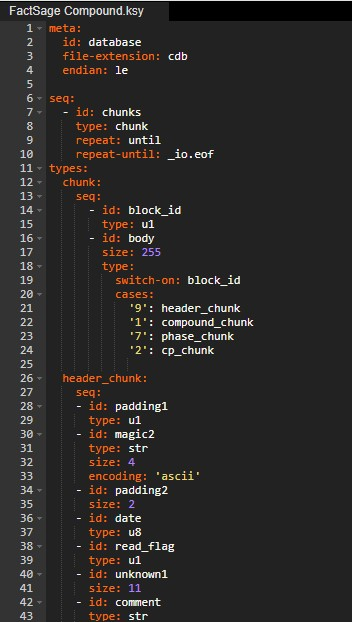
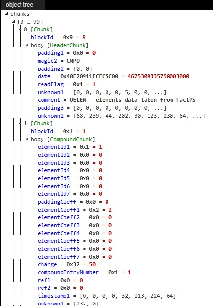
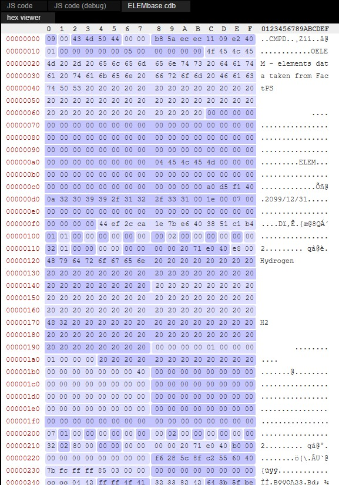

# Kaitai Struct

Kaitai Struct is an open-source declarative language and toolchain for describing binary data structures. Rather than manually writing parsers in a programming language, developers define the layout of a binary format using a human-readable YAML-based specification (`.ksy` file). The Kaitai Struct compiler then generates source code capable of reading and interpreting files that conform to the specification.

A Kaitai specification describes the organization of a binary file, including fields, data types, byte order, conditional structures, and nested records. Generated parsers are available for numerous programming languages, including C++, C#, Java, JavaScript, Python, Go, Rust, and others.

One of Kaitai Struct's most useful features is the Kaitai Web IDE, which allows a binary file and its corresponding specification to be viewed side-by-side. As the parser processes the file, individual fields are highlighted within the binary data, making it easier to understand and validate the structure of an unknown format.

Throughout this documentation, Kaitai Struct is used to formally describe the layout of Compound Database (CDB) files. The accompanying `compound-database.ksy` specification can be used to inspect CDB files, verify field offsets, and generate parsers for a variety of programming languages.

More information about the project, including documentation, source code, and the online Web IDE, is available at:

<https://kaitai.io/>

## Compound database parser

A Kaitai parser can be downloaded [HERE.](downloads/compound-database.ksy)

## Kaitai file structure editor. 

<figure markdown>
  { width="75%" }
  <figcaption> Kaitai file structure editor. </figcaption>
</figure>

## Kaitai object tree. 

<figure markdown>
  { width="75%" }
  <figcaption> Parsed object tree of the loaded CDB file. </figcaption>
</figure>

## Kaitai loaded CDB file. 

<figure markdown>
  { width="75%" }
  <figcaption> Contents of the loaded CDB file. </figcaption>
</figure>